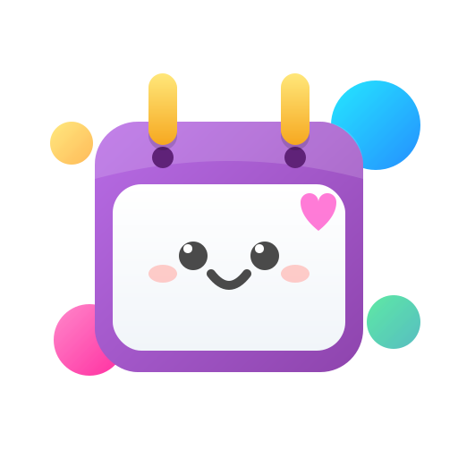
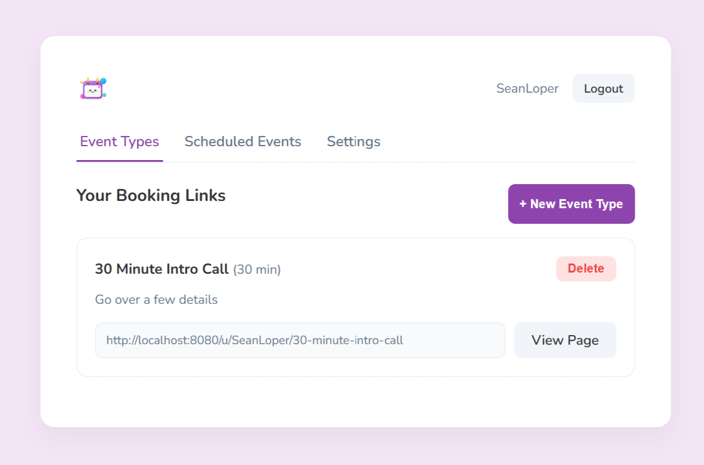
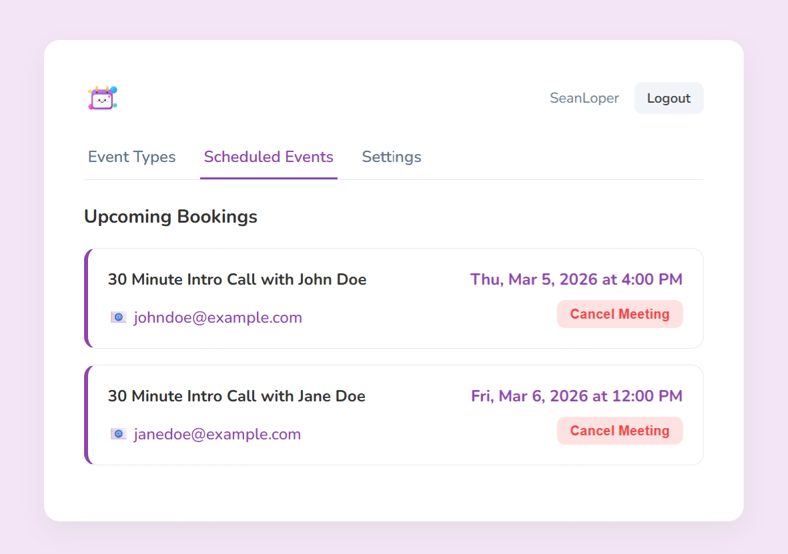
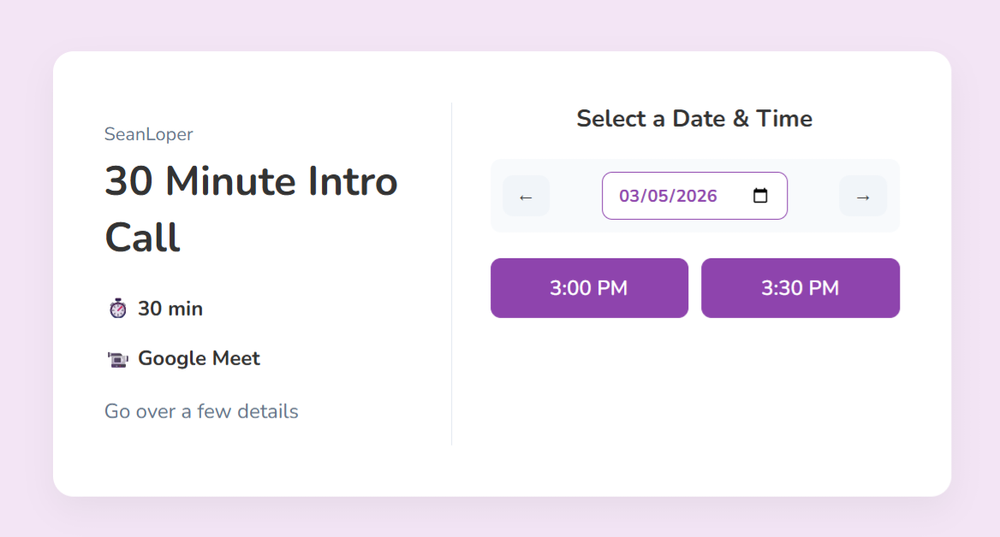

<div align="center">
  
  <h1>CalPal</h1>
  <p>A fast, self-hosted, and lightweight scheduling alternative with zero external dependencies.</p>
</div>

CalPal is a streamlined, compiled scheduling application designed to be a drop-in replacement for tools like Calendly. Built with Go and SQLite, it requires no heavy external databases and deploys instantly via a single lightweight Docker container.

## Features

* **Zero-Dependency Deployment:** Powered by a pure-Go SQLite driver (`modernc.org/sqlite`).
* **Timezone Resilience:** Built-in timezone database resolution ensuring flawless scheduling across the globe.
* **Native Calendar Invites:** Generates strict, RFC 5545 compliant `.ics` attachments and multipart MIME emails for native RSVP support in Gmail and Outlook.
* **OAuth Integrations:** Connects directly with Google and Microsoft Calendars.

## Screenshots

<div align="center">
  
  
  
</div>

## Environment Variables

CalPal is configured entirely through environment variables, making it highly compatible with Docker, Kubernetes, and minimal cloud environments.

| Variable | Description | Default | Example |
| :--- | :--- | :--- | :--- |
| `PORT` | The port the web server will listen on. | `8080` | `8080` |
| `BASE_URL` | The fully qualified URL of your deployment (used for callbacks and links). | `http://localhost:8080` | `https://cal.yourdomain.com` |
| `SMTP_HOST` | The hostname of your SMTP provider for transactional emails. | *(None)* | `smtp.mailgun.org` |
| `SMTP_PORT` | The port for your SMTP provider. | *(None)* | `587` |
| `SMTP_USER` | Your SMTP username. | *(None)* | `postmaster@yourdomain.com` |
| `SMTP_PASS` | Your SMTP password. | *(None)* | `super-secret-password` |
| `SMTP_FROM` | The email address notifications will be sent from. | *(None)* | `bookings@yourdomain.com` |
| `GOOGLE_CLIENT_ID` | OAuth Client ID for Google integration. | *(None)* | `12345-abcde.apps.googleusercontent.com` |
| `GOOGLE_CLIENT_SECRET` | OAuth Client Secret for Google integration. | *(None)* | `GOCSPX-abcdefghijklmno` |
| `MICROSOFT_CLIENT_ID` | OAuth Client ID for Microsoft integration. | *(None)* | `abcd-1234-efgh-5678` |
| `MICROSOFT_CLIENT_SECRET` | OAuth Client Secret for Microsoft integration. | *(None)* | `secret-value-here` |
| `MICROSOFT_TENANT_ID` | OAuth Tenant ID for Microsoft. Use `common` for personal accounts. | `common` | `1234abcd-56ef-78gh` |

## Running with Docker

CalPal is distributed as a highly optimized, multi-stage Docker container.

1. **Build the image:**
   ```bash
   docker build -t calpal-app .
   ```

2. **Run the container:**
   Ensure you map a volume for your SQLite database (`calpal.db`) so your data persists across restarts.

   ```bash
   # Create an empty database file first so Docker maps it as a file, not a directory
   touch calpal.db

   docker run -d \
     -p 8080:8080 \
     -v $(pwd)/calpal.db:/app/calpal.db \
     -v $(pwd)/templates/email_template.html:/app/templates/email_template.html \
     -e BASE_URL="[https://cal.yourdomain.com](https://cal.yourdomain.com)" \
     -e SMTP_HOST="smtp.provider.com" \
     -e SMTP_PORT="587" \
     --name calpal \
     calpal-app
   ```

## OAuth Integration Guide

To allow CalPal to sync automatically with host calendars, you need to configure OAuth credentials with Google and/or Microsoft.

### Google Calendar Setup
1. Go to the [Google Cloud Console](https://console.cloud.google.com/).
2. Create a new project (e.g., "CalPal Scheduling").
3. Navigate to **APIs & Services** > **OAuth consent screen** and configure it for "External" use.
4. Navigate to **APIs & Services** > **Credentials**.
5. Click **Create Credentials** > **OAuth client ID**.
6. Select **Web application** as the application type.
7. Under **Authorized redirect URIs**, add your base URL followed by the Google callback path:
   * Example: `https://cal.yourdomain.com/auth/google/callback`
8. Click **Create**. Copy the resulting **Client ID** and **Client Secret** into your `GOOGLE_CLIENT_ID` and `GOOGLE_CLIENT_SECRET` environment variables.
9. *Note: Ensure you have enabled the "Google Calendar API" in the library for this project.*

### Microsoft Outlook Setup
1. Go to the [Azure Portal](https://portal.azure.com/).
2. Navigate to **Microsoft Entra ID** (formerly Azure Active Directory) > **App registrations**.
3. Click **New registration**.
4. Name your app (e.g., "CalPal") and select "Accounts in any organizational directory and personal Microsoft accounts".
5. Under **Redirect URI**, select **Web** and input your base URL followed by the Microsoft callback path:
   * Example: `https://cal.yourdomain.com/auth/microsoft/callback`
6. Click **Register**. The "Application (client) ID" shown is your `MICROSOFT_CLIENT_ID`. The "Directory (tenant) ID" is your `MICROSOFT_TENANT_ID` (or use `common` if you selected personal accounts in step 4).
7. Navigate to **Certificates & secrets** in the left menu.
8. Click **New client secret**, give it a description, and click **Add**.
9. Copy the **Value** of the secret (not the Secret ID) and use it as your `MICROSOFT_CLIENT_SECRET` environment variable.
